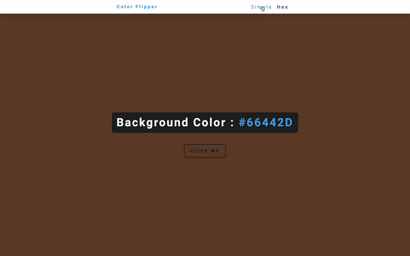

# Color Flipper

Color Flipper is a tool that allows a user to do change the background of the page by a click of button.

Your project can be styled according to your team's taste and what you invision for the persona that was selected.

This application has two modes: Simple and Hex.

- Simple View : If the application is in simple mode when the user clicks the button, the background color will be chosen by a predetermined colors.
  
  

- Hex View: If the user is in hex mode, the color that will show after the button it pressed will be a completely random hex code color.
  
  
